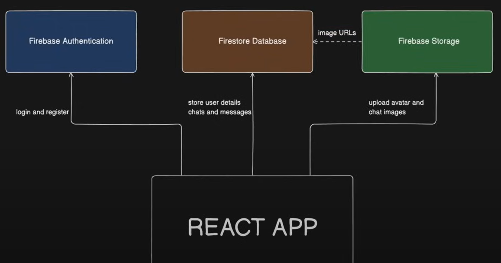

# My Realtime Chat App

A real-time simple chat application built with React, Firebase, zustand, and Vite.

## Features

- Real-time messaging
- Emoji support
- Notifications with toast messages
- Time ago formatting for messages
- blocked users
- File upload
- Search chat users

## Installation

1. Clone the repository:
   ```bash
   git clone https://github.com/yourusername/my-realtime-chat-app.git
   cd my-realtime-chat-app
   ```

2. Install dependencies:
   ```bash
   npm install
   ```

## Usage

To start the development server, run:




